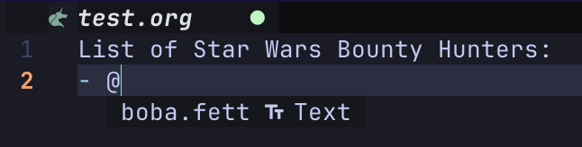
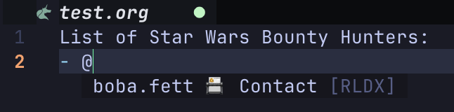

# RLDX.nvim


**Experience an Issue?**
1. Review the [Known Issues](#known-issues) to find a workaround.
2. If the issue is new then create a [Github issue](https://github.com/michhernand/RLDX.nvim/issues).

# 🎷 Features
- Autocomplete for your contact list.
- At-rest obfuscation of contact list.
- Syntax highlighting for contacts.


# 📎 Requirements
- Tested on Neovim 0.10.0.
- [nvim-cmp](https://github.com/hrsh7th/nvim-cmp)

# 💾 Installation
1. Add to your Neovim package manager's configuration. See specific steps below.
2. Update your cmp-nvim configuration.
3. [Optional] Update your cmp-nvim `formatting` configuration.

## Package Managers
### Lazy
```lua
{
    "michhernand/RLDX.nvim",
    event = "VeryLazy",
    dependencies = {
        "hrsh7th/nvim-cmp",
    },
    opts = {} -- see configuration docs for details
}
```

### Other Package Managers Coming Soon
...

## Completions Engine Configuration
### nvim-cmp
#### [Required] Core Configuration
nvim-cmp configuration for all file types.
```lua
require('cmp').setup({
    sources = {
        { name = 'cmp_rolodex' }
    }
})
```

nvim-cmp configuration for select file types.
```lua
require('cmp').setup.filetype('org', {
    sources = {
        { name = 'cmp_rolodex' }
    },
 })

```


#### [Optional] Formatting
An optional feature is to add formatting for nvim-cmp to display the type and source of the completion.

_A completion without formatting applied._


_A completion with formatting applied._


```lua
-- nvim-cmp.lua

return {
    "hrsh7th/nvim-cmp",
    config = function()
        formatting = {
            format = function(entry, vim_item)
                if entry.source.name = "cmp_rolodex" then
                    vim_item.kind = "📇 Contact"
                    vim_item.menu = "[RLDX]"
                end
                return vim_item
            end
        }
    end
}
```

# ⚙️ Configuration
## Default Configuration
```lua
opts = {
    prefix_char = "@",
    filename = os.getenv("HOME") .. "/.rolodex/db.json"),
    highlight_enabled = true,
    highlight_color = "00ffff",
    highlight_bold = true,
    schema_ver = "latest",
    encryption = "elementwise_xor",
}
```

## Prefix Char
`prefix_char` (str) is the character that triggers autocomplete.

## DB Filename
`filename` (str) is the location where your contacts are stored.

## Highlighting
### Highlight Enabled
`highlight_enabled` (bool) is a flag indicating whether highlighting of names is enabled.

### Highlight Color
`highlight_color` (str) is a hex color code indicating what color names should be highlighted as.

### Highlight Bold
`highlight_bold` (bool) is a flag indicating whether highlighted names should be bolded.

## Schema Version
`schema_ver` (string) tells RLDX what version of the schmea to use when writing out data. Options include '0.0.2' or '0.1.0'. 'latest' (which is the default) is also an option which automatically upgrades your catalog to the latest backwards-compatible schema.

## Encryption
`encryption` (str) is the chosen encryption methodology. Options include:
- `plaintext`: No encryption of fields.
- `elementwise_xor` (only available for schema_ver >= '0.1.0'): xor encryption of each contact.

# 🖋️ Usage
## Autocomplete

## Adding Contacts


# 🔒 Obfuscation
RLDX optionally provides obfuscation of data at rest. RLDX and its maintainers make no guarantees around security. For a full breakdown of obfuscation, see the [Obfuscation Doc](./docs/obfuscation.org).

## What Is Obfuscation?
- In `schema_ver` >= 0.1.0, RLDX provides:
    - **Very** light encryption of names.
    - Hashing of names to guarantee uniqueness.
- To enable obfuscation, see the instructions in [Obfusfaction Doc](./docs/obfuscation.org)

# 🚘 Roadmap
- [X] ~~Obfuscation~~
- [ ] Form for adding contacts
- [ ] Allow saving all contacts
- [ ] Allow loading all contacts
- [ ] Allow deleting contacts
- [ ] Allow updating contacts
- [ ] Allow showing of contact details
- [ ] Blink.nvim compatability
- [ ] Grep files by contact name

# 🦗 Known Issues
## [RESOLVED in v0.1.0] Shows duplicate autocomplete recommendations.
This appears to happen when you add contacts and then query them in the same session. A workaround is to exit and re-launch Neovim.
## [RESOLVED in v0.1.0] Highlighting does not initialize on lazy loading.
This appears to happen when lazy loading with Lazy.nvim. A workaround is to set `lazy = false` in opts.
- Only highlighting is affected here. Other functionality is unaffected.
## Highlighting does not intiialize some org-roam files.
This appears to happen when a new org-roam file is created via org-roam-capture. This resolves when Neovim is restarted.
- Only highlighting is affected here. Other functionality is unaffected.

# 🏆 Acknowledgements
- md5.lua is provided by [md5](https://github.com/kikito/md5.lua)
- xor.lua is provided by [xor](https://github.com/Braayy/xor-lua)
