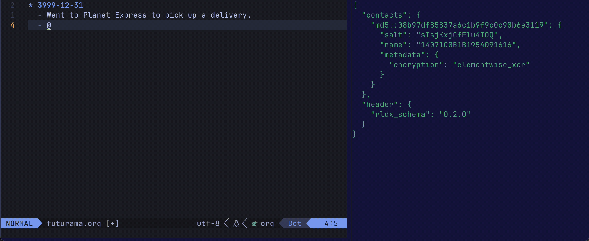
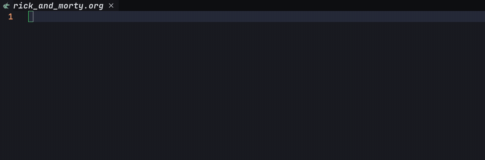
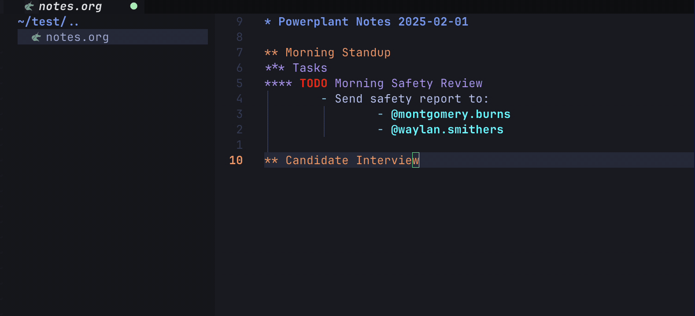

# rolodex.nvim


**Experience an Issue?**
1. Review the [Known Issues](#known-issues) to find a workaround.
2. If the issue is new then create a [Github issue](https://github.com/michhernand/rolodex.nvim/issues).

# Features
- Autocomplete for your contact list.
- Syntax highlighting for contacts.


# Requirements
- Tested on Neovim 0.10.0.
- [nvim-cmp](https://github.com/hrsh7th/nvim-cmp)

# Installation
1. Add to your Neovim package manager's configuration. See specific steps below.
2. Update your cmp-nvim configuration.

nvim-cmp configuration for all file types.
```lua
require('cmp').setup({
    sources = {
        { name = 'cmp_rolodex' }
    }
})
```

nvim-cmp configuration for select file types.
```lua
require('cmp').setup.filetype('org', {
    sources = {
        { name = 'cmp_rolodex' }
    },
 })

```

## Package Managers
### Lazy
lazy configuration for all file types.
```lua
{
    "michhernand/rolodex.nvim",
    lazy = true,
    event = { "BufReadPost", "BufNewFile" },
    opts = {} -- see configuration docs for details
}
```

lazy configuration for select file types.
```lua
{
    "michhernand/rolodex.nvim",
    lazy = true,
    event = {
        "BufReadPost *.org", "BufNewFile *.org",
        "BufReadPost *.md", "BufNewFile *.md",
    },
    opts = {} -- see configuration docs for details
}
```

### Other Package Managers Coming Soon
...

# Configuration
## Default Configuration
```lua
opts = {
    prefix_char = "@",
    db_filename = os.getenv("HOME") .. "/.rolodex/db.json"),
    highlight_enabled = true,
    highlight_color = "00ffff",
    highlight_bold = true
}
```

## Prefix Char
`prefix_char` (str) is the character that triggers autocomplete.

## DB Filename
`db_filename` (str) is the location where your contacts are stored.

## Highlighting
### Highlight Enabled
`highlight_enabled` (bool) is a flag indicating whether highlighting of names is enabled.

### Highlight Color
`highlight_color` (str) is a hex color code indicating what color names should be highlighted as.

### Highlight Bold
`highlight_bold` (bool) is a flag indicating whether highlighted names should be bolded.

# Usage
## Autocomplete

## Adding Contacts


# Roadmap
- [ ] Delete contacts.
- [ ] Update contacts.
- [ ] Grep files by contact name.

# Known Issues
## Shows duplicate autocomplete recommendations.
This appears to happen when you add contacts and then query them in the same session. A workaround is to exit and re-launch Neovim.
## Highlighting does not initialize on lazy loading.
This appears to happen when lazy loading with Lazy.nvim. A workaround is to set `lazy = false` in opts.

# Acknowledgements
- JSON read / write functionality is provided by [json.lua](https://github.com/rxi/json.lua?tab=readme-ov-file).
