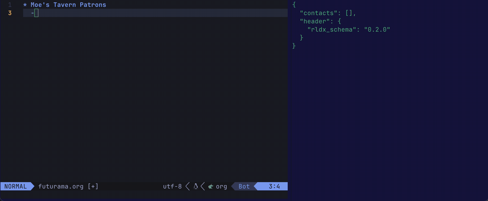
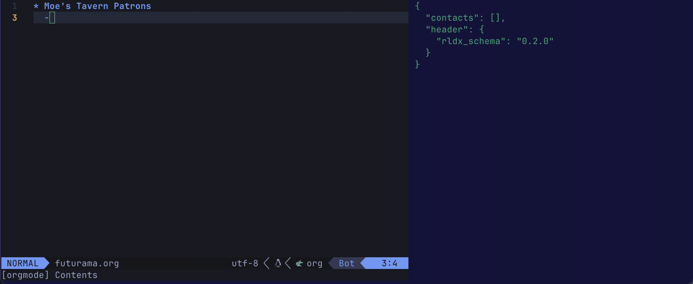

# RLDX.nvim


**Experience an Issue?**
1. Review the [Known Issues](#known-issues) to find a workaround.
2. If the issue is new then create a [Github issue](https://github.com/michhernand/RLDX.nvim/issues).

# Features
- Autocomplete for your contact list.
- Syntax highlighting for contacts.


# Requirements
- Tested on Neovim 0.10.0.
- [nvim-cmp](https://github.com/hrsh7th/nvim-cmp)

# Installation
1. Add to your Neovim package manager's configuration. See specific steps below.
2. Update your cmp-nvim configuration.

nvim-cmp configuration for all file types.
```lua
require('cmp').setup({
    sources = {
        { name = 'cmp_rolodex' }
    }
})
```

nvim-cmp configuration for select file types.
```lua
require('cmp').setup.filetype('org', {
    sources = {
        { name = 'cmp_rolodex' }
    },
 })

```

## Package Managers
### Lazy
lazy configuration for all file types.
```lua
{
    "michhernand/RLDX.nvim",
    event = "VeryLazy",
    dependencies = {
        "hrsh7th/nvim-cmp",
    },
    opts = {} -- see configuration docs for details
}
```

lazy configuration for select file types.
```lua
{
    "michhernand/RLDX.nvim",
    event = "VeryLazy",
    dependencies = {
        "hrsh7th/nvim-cmp",
    },
    opts = {} -- see configuration docs for details
}
```

### Other Package Managers Coming Soon
...

# Configuration
## Default Configuration
```lua
opts = {
    prefix_char = "@",
    filename = os.getenv("HOME") .. "/.rolodex/db.json"),
    highlight_enabled = true,
    highlight_color = "00ffff",
    highlight_bold = true,
    schema_ver = "latest",
    encryption = "elementwise_xor",
}
```

## Prefix Char
`prefix_char` (str) is the character that triggers autocomplete.

## DB Filename
`filename` (str) is the location where your contacts are stored.

## Highlighting
### Highlight Enabled
`highlight_enabled` (bool) is a flag indicating whether highlighting of names is enabled.

### Highlight Color
`highlight_color` (str) is a hex color code indicating what color names should be highlighted as.

### Highlight Bold
`highlight_bold` (bool) is a flag indicating whether highlighted names should be bolded.

## Schema Version
`schema_ver` (string) tells RLDX what version of the schmea to use when writing out data. Options include '0.0.2' or '0.1.0'. 'latest' (which is the default) is also an option which automatically upgrades your catalog to the latest backwards-compatible schema.

## Encryption
`encryption` (str) is the chosen encryption methodology. Options include:
- `plaintext`: No encryption of fields.
- `elementwise_xor` (only available for schema_ver >= '0.1.0'): xor encryption of each contact.

## [Optional] Formatting for nvim-cmp
An optional feature is to add formatting for nvim-cmp to display the type and source of the completion.

```lua
-- nvim-cmp.lua

return {
    "hrsh7th/nvim-cmp",
    config = function()
        formatting = {
            format = function(entry, vim_item)
                if entry.source.name = "cmp_rolodex" then
                    vim_item.kind = "📇 Contact"
                    vim_item.menu = "[RLDX]"
                end
                return vim_item
            end
        }
    end
}
```

You may already have `formatting` configured. Possibly like...
```lua
return {
    "hrsh7th/nvim-cmp",
    config = function()
        formatting = {
            format = lspkind.cmp_format({
            maxwidth = 50,
                ellipsis_char = "...",
            }),
        }
    end
}
```

In such a case, you can merge your `formatting` with the RLDX `formatting`.
```lua
return {
    "hrsh7th/nvim-cmp",
    config = function()
	formatting = {
		format = function(entry, vim_item)
            -- Existing configuration
		    local format_func = lspkind.cmp_format({
				maxwidth = 50,
				ellipsis_char = "...",
			})
			vim_item = format_func(entry, vim_item)

            -- RLDX configuration
			if entry.source.name == "cmp_rolodex" then
				vim_item.kind = "📇 Contact"
				vim_item.menu = "[RLDX]"
			end

			return vim_item
		end
	}
    end
}
```

# Usage
## Autocomplete

## Adding Contacts


# Obfuscation
RLDX does **not** provide any guarantees around security or encryption. If you want a more secure setup, then it's recommended to manually encrypt your catalog file using another tool.

What RLDX does offer (in `schema_ver` >= 0.1.0) is:
- **Very** light encryption of names.
- Hashing of names to guarantee uniqueness.

To reiterate, neither of the above features should be considered security features. Rather, they provide a light layer of obfuscation for your catalog.

To enable obfuscation, set 'encryption' to 'elementwise_xor' in your opts. Additionally, set the `RLDX_ENCRYPTION_KEY` environment variable.

## Nuances
### Catalog Upgarde
In this example, let's assume a user has the following catalog:
```lua
-- Schema Version 0.0.2
{
	{
		"name": "bender.rodriguez",
		"count": 10
	},
	{
		"name": "hermes.conrad",
		"count": 4
	}
}
```

If `opts.schema_ver` is set to `0.1.0` or `latest`, then:
- RLDX will read the catalog using the v0.0.2 schema.
- When RLDX writes the catalog out, it will use the v0.1.0 schema.
    - Note, if `opts.encryption` is set to `elementwise_xor` then the `RLDX_ENCRYPTION_KEY` environment variable must be set. Otherwise, read / write operations will fail.

Otherwise, if `opts.schema_ver` is set to `0.0.2`, then:
- RLDX will read and write the catalog using the v0.0.2 schema.
- Encryption and hashing features will be disabled.

### Unencrypted Catalog
In this example, let's assume the user has the following catalog:
```lua
-- Schema Version 0.1.0
{
	"header" = {
		"rldx_schema" = "0.1.0"
	},

	"contacts": {
		"md5::6249d49c40f102ed53ba5e680d016085": {
			"name": "bender.rodriguez",
			"metadata": {
				"encryption": "plaintext"
			}
		},
	}
}
```

If `opts.schema_ver` is set to `0.0.2` then a schema DOWNGRADE will occur upon write.

Otherwise, if `opts.schema_ver` is set to `0.1.0` or `latest`, then:
- RLDX will read and write the catalog using the v0.1.0 schema.
- If `opts.encryption` is set to `elementwise_xor` and `RLDX_ENCRYPTION_KEY` is set. Then, upon write, the catalog entries will be lightly encrypted. See `Encrypted Catalog` section for an example.
- If `opts.encryption` is set to `plaintext`, then the `name` attribute of each contact will remain as plaintext.

### Encrypted Catalog
In this example, let's assume the user has the following catalog:
```lua
-- Schema Version 0.1.0
{
	"header" = {
		"rldx_schema" = "0.1.0"
	},

	"contacts": {
		"md5::6249d49c40f102ed53ba5e680d016085": {
			"name": "04101a11171343130911061c1514081b",
			"metadata": {
				"encryption": "elementwise_xor"
			}
		},
	}
}
```

Similar to earlier, if `opts.schema_ver` is set to `0.0.2` then a schema DOWNGRADE will occur upon write.

Otherwise, if `opts.schema_ver` is set to `0.1.0` or `latest`, then:
- RLDX will read and write the catalog using the v0.1.0 schema.
- If `opts.encryption` is set to `elementwise_xor` and `RLDX_ENCRYPTION_KEY` is set. Then, upon write, the catalog entries will be obfuscated.
- If `opts.encryption` is set to `plaintext`, then the `name` attribute of each contact will remain as plaintext.

# Roadmap
- [X] ~~Obfuscation~~
- [ ] Form for adding contacts
- [ ] Allow saving all contacts
- [ ] Allow loading all contacts
- [ ] Allow deleting contacts
- [ ] Allow updating contacts
- [ ] Blink.nvim compatability
- [ ] Grep files by contact name

# Known Issues
## [RESOLVED in v0.1.0] Shows duplicate autocomplete recommendations.
This appears to happen when you add contacts and then query them in the same session. A workaround is to exit and re-launch Neovim.
## [RESOLVED in v0.1.0] Highlighting does not initialize on lazy loading.
This appears to happen when lazy loading with Lazy.nvim. A workaround is to set `lazy = false` in opts.
- Only highlighting is affected here. Other functionality is unaffected.
## Highlighting does not intiialize some org-roam files.
This appears to happen when a new org-roam file is created via org-roam-capture. This resolves when Neovim is restarted.
- Only highlighting is affected here. Other functionality is unaffected.

# Acknowledgements
- md5.lua is provided by [md5](https://github.com/kikito/md5.lua)
- xor.lua is provided by [xor](https://github.com/Braayy/xor-lua)
